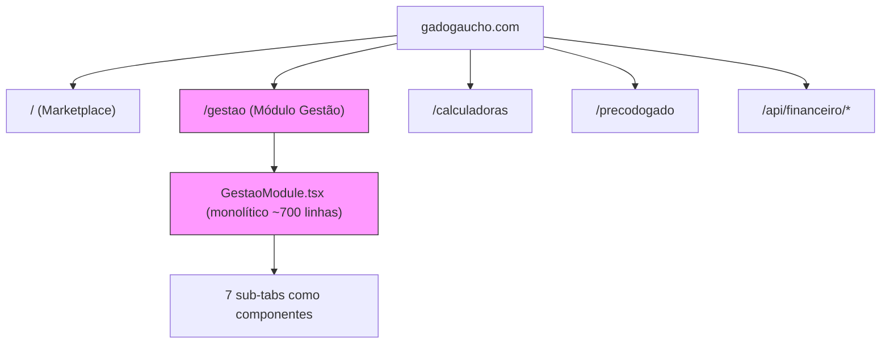
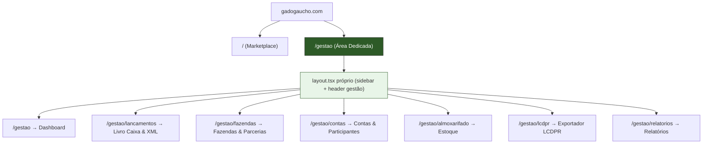

# 🏗️ Plano de Desacoplamento — Módulo de Gestão

## Situação Atual

O módulo de Gestão vive **dentro** do site principal Gado Gaúcho como uma rota (`/gestao`) que renderiza o componente monolítico `GestaoModule.tsx`. Ele compartilha o mesmo layout, Header, Footer, sistema de auth e contexto global com o marketplace de gado.



### Componentes envolvidos hoje

| Arquivo | Tamanho | Função |
|---|---|---|
| [GestaoModule.tsx](file:///d:/antigravity/gadogaucho_v3/components/gestao/GestaoModule.tsx) | ~705 linhas | Orquestrador monolítico (state, handlers, tabs) |
| [DashboardTab.tsx](file:///d:/antigravity/gadogaucho_v3/components/gestao/DashboardTab.tsx) | ~11 KB | Visão geral e DRE |
| [LancamentosTab.tsx](file:///d:/antigravity/gadogaucho_v3/components/gestao/LancamentosTab.tsx) | ~37 KB | Livro caixa, XML import |
| [FazendasTab.tsx](file:///d:/antigravity/gadogaucho_v3/components/gestao/FazendasTab.tsx) | ~15 KB | CRUD fazendas |
| [ContasParticipantesTab.tsx](file:///d:/antigravity/gadogaucho_v3/components/gestao/ContasParticipantesTab.tsx) | ~16 KB | Contas bancárias e participantes |
| [LcdprTab.tsx](file:///d:/antigravity/gadogaucho_v3/components/gestao/LcdprTab.tsx) | ~12 KB | Exportador LCDPR |
| [AlmoxarifadoTab.tsx](file:///d:/antigravity/gadogaucho_v3/components/gestao/AlmoxarifadoTab.tsx) | ~24 KB | Estoque e movimentações |
| [RelatoriosTab.tsx](file:///d:/antigravity/gadogaucho_v3/components/gestao/RelatoriosTab.tsx) | ~24 KB | Relatórios e rentabilidade |
| [route.ts (6 APIs)](file:///d:/antigravity/gadogaucho_v3/app/api/financeiro) | ~10 KB cada | fazendas, contas, participantes, lancamentos, almoxarifado, xml-import |

---

## Proposta: Área Dedicada com Rotas Individuais

Transformar cada tab do módulo em uma **página Next.js independente** sob `/gestao/*`, com um layout compartilhado próprio (sidebar lateral + header dedicado), totalmente separado do layout do marketplace.



---

## Fases de Execução

### Fase 1 — Layout Dedicado da Gestão
> **Esforço**: Baixo (~30 min) | **Risco**: Nenhum

- Criar `app/gestao/layout.tsx` com:
  - **Sidebar lateral fixa** (ao invés das tabs horizontais atuais) com ícones + labels para cada módulo
  - **Header simplificado** da gestão (logo Gado Gaúcho, nome do usuário, botão "Voltar ao Marketplace")
  - Responsividade: sidebar colapsa em hamburger no mobile
- O `Footer` global do `app/layout.tsx` já é compartilhado — não precisa duplicar

### Fase 2 — Extrair o State para um Context Dedicado
> **Esforço**: Médio (~1h) | **Risco**: Baixo

Hoje toda a lógica de dados (fazendas, contas, participantes, lancamentos, produtos) vive no `GestaoModule.tsx`. Isso precisa sair para um **Context Provider** que envolva todas as sub-páginas.

- Criar `context/GestaoContext.tsx` contendo:
  - Todo o state (`fazendas`, `contas`, `participantes`, `lancamentos`, `produtos`)
  - A função `loadData()` 
  - Todos os handlers (add/edit/delete para cada entidade, `handleImportXml`, `syncItensToAlmoxarifado`)
  - Valores computados (`totalReceita`, `totalDespesa`, `saldo`, `monthlyData`, `categoryBreakdown`)
- Envolver o layout da gestão com `<GestaoProvider>`
- Cada sub-página consome `useGestao()` para acessar os dados e funções

### Fase 3 — Criar Rotas Individuais por Módulo
> **Esforço**: Médio (~1h) | **Risco**: Baixo

Transformar cada tab em uma página com rota própria:

| Rota | Componente Renderizado | Origem |
|---|---|---|
| `/gestao` | `DashboardTab` | Página raiz (dashboard) |
| `/gestao/lancamentos` | `LancamentosTab` | Nova rota |
| `/gestao/fazendas` | `FazendasTab` | Nova rota |
| `/gestao/contas` | `ContasParticipantesTab` | Nova rota |
| `/gestao/almoxarifado` | `AlmoxarifadoTab` | Nova rota |
| `/gestao/lcdpr` | `LcdprTab` | Nova rota |
| `/gestao/relatorios` | `RelatoriosTab` | Nova rota |

Cada `page.tsx` é trivial — importa o componente tab existente e passa props do contexto:
```tsx
// app/gestao/lancamentos/page.tsx
'use client';
import { LancamentosTab } from '@/components/gestao/LancamentosTab';
import { useGestao } from '@/context/GestaoContext';

export default function LancamentosPage() {
  const { lancamentos, fazendas, contas, participantes, ... } = useGestao();
  return <LancamentosTab {...props} />;
}
```

### Fase 4 — Aposentar o Componente Monolítico
> **Esforço**: Baixo (~15 min) | **Risco**: Nenhum

- Remover `GestaoModule.tsx` (toda a sua lógica já estará no Context + sub-páginas)
- Atualizar o link do Header principal (`/gestao` continua funcionando, agora como dashboard)
- Redirecionar `/financeiro` → `/gestao` (já existe)

### Fase 5 (Opcional) — Proteção de Rota e Loading States
> **Esforço**: Baixo (~20 min) | **Risco**: Nenhum

- Adicionar `loading.tsx` em `app/gestao/` para skeleton de carregamento
- Validar autenticação no layout da gestão (redirect para login se não autenticado, em vez de renderizar a tela de bloqueio atual)
- Adicionar breadcrumbs na área de gestão

---

## Estrutura de Arquivos Resultante

```
app/gestao/
├── layout.tsx               ← Layout dedicado (sidebar + header gestão)
├── loading.tsx               ← Skeleton de carregamento
├── page.tsx                  ← Dashboard (Visão Geral & DRE)
├── lancamentos/
│   └── page.tsx              ← Livro Caixa & XML Import
├── fazendas/
│   └── page.tsx              ← Fazendas & Parcerias
├── contas/
│   └── page.tsx              ← Contas & Participantes
├── almoxarifado/
│   └── page.tsx              ← Estoque & Movimentações
├── lcdpr/
│   └── page.tsx              ← Exportador LCDPR
└── relatorios/
    └── page.tsx              ← Relatórios & Rentabilidade

context/
└── GestaoContext.tsx         ← State + handlers extraídos do GestaoModule

components/gestao/
├── GestaoSidebar.tsx         ← NOVO: Sidebar de navegação
├── GestaoHeader.tsx          ← NOVO: Header simplificado da área
├── DashboardTab.tsx          ← Existente (sem alteração)
├── LancamentosTab.tsx        ← Existente (sem alteração)
├── FazendasTab.tsx           ← Existente (sem alteração)
├── ContasParticipantesTab.tsx← Existente (sem alteração)
├── LcdprTab.tsx              ← Existente (sem alteração)
├── AlmoxarifadoTab.tsx       ← Existente (sem alteração)
└── RelatoriosTab.tsx         ← Existente (sem alteração)

❌ components/gestao/GestaoModule.tsx  ← REMOVIDO (aposentado)
```

---

## O que NÃO muda

- ✅ As 6 API routes em `/api/financeiro/*` continuam inalteradas
- ✅ Os 7 componentes de tab continuam inalterados (apenas recebem props de forma diferente)
- ✅ O banco de dados e tabelas Supabase ficam iguais
- ✅ O Header principal do marketplace mantém o link "Gestão"
- ✅ O middleware de autenticação não precisa de alteração

---

## Benefícios do Desacoplamento

| Antes | Depois |
|---|---|
| URL única `/gestao` com tabs internas | Rotas individuais (`/gestao/lancamentos`, etc.) com URLs compartilháveis |
| Toda a lógica concentrada num arquivo de 705 linhas | State no Context, UI nas pages — separação de responsabilidades |
| Navegação por state interno (sem histórico do browser) | Navegação nativa com back/forward do browser |
| Layout compartilhado com o marketplace | Layout dedicado com sidebar profissional |
| Todo o JS de todas as tabs carregado de uma vez | Code-splitting automático por rota (cada page é lazy-loaded) |

---

## Estimativa Total

| Fase | Tempo | Complexidade |
|---|---|---|
| 1. Layout dedicado (sidebar + header) | ~30 min | 🟢 Baixa |
| 2. Context de estado | ~1h | 🟡 Média |
| 3. Rotas individuais | ~1h | 🟡 Média |
| 4. Aposentar monolítico | ~15 min | 🟢 Baixa |
| 5. Polish (loading, proteção, breadcrumbs) | ~20 min | 🟢 Baixa |
| **Total** | **~3h** | — |

> [!TIP]
> O risco geral é **baixo** porque os componentes de tab não precisam ser modificados — apenas a forma como recebem dados muda (de props passadas pelo monolítico para props vindas do Context).
